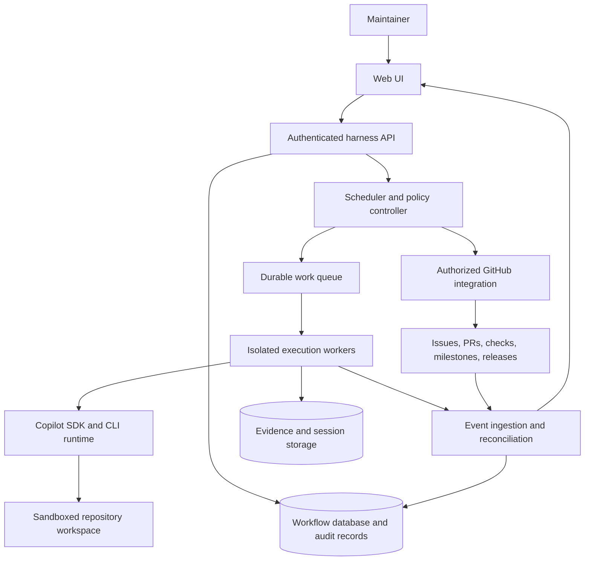

## Executive Summary

Build an autonomous software-delivery harness around the GitHub Copilot SDK.
A maintainer supplies a repository, objective, acceptance criteria, spending
budget, and deadline. The harness proposes a milestone, allocates work to
specialist agents, executes within approved permissions, and presents evidence
for human approval before release.

A web UI supports objective input, decisions, live monitoring, and historical
milestone review. Copilot supplies the agent runtime, models, skills, and tools.
The harness supplies durable workflow state, budget allocation, deadline
management, permission enforcement, quality gates, and release governance.

The product promise is bounded autonomy with transparent outcomes. It is not a
guarantee that any objective can be completed within an arbitrary budget or time.
When an objective becomes infeasible, the harness stops affected work and offers
evidence-backed options rather than silently increasing spending or reducing
quality.

## Status and Decision Boundaries

This is a portable starting design for a new repository. It does not depend on
the application in which the original discussion took place. No implementation,
SDK compatibility test, performance benchmark, or production validation has been
completed. Public-source capabilities were researched on September 26, 2026.

| Direction | Status |
| --- | --- |
| Build within the GitHub Copilot ecosystem | User preference |
| Use the Copilot SDK as the execution foundation | Proposed approach supported by documentation |
| Reuse skills, instructions, and specialist agent concepts | User direction; compatibility checks required |
| Let humans set objectives, budgets, and time constraints | Core product requirement |
| Provide input, approval, and historical milestone UI | Core product requirement |
| Use the architecture and policies below | Proposed design, subject to maintainer review |
| Select an implementation language, UI framework, database, and hosting platform | Open decision |

This document authorizes no repository mutations, merges, releases, deployments,
or account expenditure. Those require separately approved implementation and
operational actions.

## Goals and Non-Goals

### Goals

- Turn a bounded objective into reviewed stories and a proposed milestone.
- Allocate budget and time across planning, implementation, testing, and review.
- Support different eligible models for different roles and tasks.
- Reuse repository-local conventions and portable capability packages.
- Make approval requests actionable and preserve their decision history.
- Report completed, incomplete, failed, and cancelled work honestly.
- Link milestone evidence to GitHub issues, pull requests, checks, and releases.
- Resume authorized work safely after worker restarts or user disconnection.

### Non-Goals

- Train a new foundation model or replace Copilot's tool-use loop.
- Reproduce every VS Code extension capability inside the SDK.
- Guarantee successful delivery merely because funds and time were allocated.
- Make agents the final authority for scope, budget, or release acceptance.
- Automatically deploy to production or bypass repository protections.
- Build a general-purpose autonomous company platform in the first version.
- Claim that the complete idea is unique or has no competing implementation.

## Core Hypothesis and Feasibility

The hypothesis is that a human can choose a useful trade-off between total cost,
elapsed time, and the likelihood of an accepted result. A cheaper model may
suffice for bounded tasks with more iterations. A more capable model may resolve
difficult tasks in fewer attempts and therefore cost less overall.

Neither relationship is guaranteed. Price is not a reliable proxy for quality,
and extra time does not necessarily compensate for missing capability. Evaluate
cost and time per accepted outcome, not just token prices or iteration counts.
Acceptance criteria remain fixed unless the human explicitly approves a change.

The control mechanisms are feasible with existing software primitives. The
unproven parts are forecasting accuracy, economic benefit on representative
repositories, and the reliability of the complete workflow.

### Existing Work

| Project | Relevant overlap | Implication |
| --- | --- | --- |
| [Paperclip](https://github.com/paperclipai/paperclip) | Goals, agent teams, budgets, approvals, cost tracking | Closest platform comparator; governance itself is not new |
| [MetaGPT](https://github.com/FoundationAgents/MetaGPT) | Product, architecture, and engineering roles | A simulated software team is an established pattern |
| [OpenHands](https://github.com/OpenHands/OpenHands) | Coding-agent execution and automations | Reuse execution capabilities rather than rebuilding them |
| [SWE-agent](https://github.com/SWE-agent/SWE-agent) | Model-driven repository issue resolution | Useful task-level comparison; upstream recommends mini-SWE-agent for new use |
| [Harness](https://github.com/sausheong/harness) | Reusable cost and persistent time-budget primitives | Budget and deadline controls are established building blocks |
| [Agent Budget Controller](https://github.com/reaatech/agent-budget-controller) | Budget checks and model downgrade policies | Adjacent component; some integrations/publication remained roadmap work |

The potential differentiation is a repository-native objective-to-release
workflow that combines measured model selection, budget/deadline forecasts,
quality evidence, and durable human decisions. This is a product hypothesis,
not a proven gap in the market. Prefer integrating existing capabilities where
they meet the GitHub/Copilot direction.

## Product Model

| Concept | Meaning |
| --- | --- |
| Objective | Human-requested outcome, repository, acceptance criteria, and approved constraints |
| Milestone | Versioned delivery scope containing reviewed stories and linked GitHub work |
| Story | Bounded unit of work with acceptance criteria, dependencies, and validation requirements |
| Agent role | Reusable responsibility, prompt, skills, model policy, and tool allowlist |
| Run | A scheduled execution with an identity, allocation, deadline, and configuration snapshot |
| Attempt | One bounded try within a run or story; retries retain prior evidence and charges |
| Approval | An authorized human decision bound to a specific proposed action and revision |
| Evidence | Test result, review, diff, document, or release artifact tied to an immutable source revision |

An objective may span several milestones. A milestone may contain many runs,
and a story may require multiple attempts. A Copilot session is execution context,
not the authoritative milestone record.

## Proposed Architecture

Use a modular backend with separately managed execution workers. The browser
never needs direct access to provider credentials or an unrestricted CLI server.
The backend owns policy and durable state; workers perform admitted tasks.



The UI reads durable snapshots and live updates. Workers can continue permitted
work when the browser closes. Approval-dependent work stays blocked until an
authorized decision is durably recorded. Storage and queue implementations are
open choices; the first deployment need not use separate microservices.

### Ownership Boundaries

| Layer | Owns | Does not own |
| --- | --- | --- |
| Web UI | Input, review, approval interactions, monitoring, history | Credentials, final authorization, worker lifetime |
| Harness backend | Workflow transitions, budget reservations, deadlines, decisions, audit | Model reasoning or an invented replacement for Copilot's agent loop |
| Copilot SDK/runtime | Sessions, model interactions, tool-use execution, capability loading, events | Business acceptance, a guaranteed dollar ceiling, complete milestone history |
| GitHub integration | Authorized issue/PR/release actions and remote-state reconciliation | Permission to bypass branch protections |
| Evidence store | Versioned reports, artifact hashes, redacted logs, resumable session data | Proof of approval without the matching decision record |

## Copilot Integration

Current SDK documentation supports model discovery and selection, custom agents,
skill directories, system messages, MCP servers, permission handlers, streaming
events, and session resume. Some advanced APIs are experimental or may exist on
the default branch before the selected release. Pin the SDK and compatible CLI
runtime, then verify the required feature set before building against it.

| Capability | Intended use | Important qualification |
| --- | --- | --- |
| Model discovery and pricing metadata | Offer eligible models and estimate allocations | Availability depends on identity, plan, policy, and runtime |
| Per-session and per-agent models | Match work to capability and cost | Selection policy is owned by the harness, not inferred from price alone |
| Skills | Reuse testing, review, release, and domain procedures | Load explicit directories; required per-agent skills must be assigned explicitly |
| Repository instructions | Apply coding, validation, and contribution conventions | Discovery depends on working directory, configuration, and supported runtime behavior |
| Custom agents | Define specialist roles, prompts, skills, and allowed tools | Role definitions do not imply a separate process or unlimited delegation |
| MCP and custom tools | Expose bounded GitHub and validation operations | Loading instructions does not install tools or authorize access |
| Hooks and permission handlers | Intercept supported actions and request decisions | Business approvals and enforced authorization remain backend responsibilities |
| Usage and session limits | Track usage and provide per-session spending guards | Credit caps are soft; some metrics APIs are experimental |
| Sessions and events | Resume context and project progress into the UI | Some events are transient and are not replayed |

### Repository-Local Customization

The following is an illustrative layout, not an SDK configuration schema:

```text
target-repository/
  .github/
    copilot-instructions.md
    instructions/
      testing.instructions.md
      security.instructions.md
    skills/
      review-change/
        SKILL.md
      validate-release/
        SKILL.md
    agents/
      architect.agent.md
      engineer.agent.md
  .harness/
    policy.yaml
```

The proposed `.harness/policy.yaml` is a harness-owned format to define later.
It contains no credentials and cannot grant itself authority. Trusted defaults,
repository permissions, and human-approved policy revisions constrain it.

Copilot CLI supports repository-wide instructions, path-specific instruction
files with `applyTo`, and agent guidance such as `AGENTS.md`. The SDK can also
receive explicit session instructions and agent definitions. Use the supported
SDK/runtime loader or an explicit adapter for file-based agent profiles; do not
assume all VS Code frontmatter fields are portable.

The runtime is not the user's existing VS Code session. Editor-only tools,
slash commands, UI handoffs, absolute local paths, and extension-specific
references require adaptation. Record loaded capability versions for each run.
For repeatability, explicitly load trusted packages instead of depending on
whatever a worker account happens to have installed.

## Agent Roles and Configuration

| Role | Responsibility | Expected output |
| --- | --- | --- |
| Product owner | Triage the objective and relevant issues/security findings; prioritize and clarify stories | Reviewed backlog and proposed milestone scope |
| Architect | Assess feasibility, dependencies, design needs, model allocation, and integration risks | Design documents and estimated delivery options |
| Software engineer | Implement bounded stories and unit tests | Tested change and pull request |
| DevOps engineer | Implement required build and CI/CD changes | Validated pipeline change and pull request |
| QA automation engineer | Add required integration or end-to-end checks | Automated tests and evidence |
| QA engineer | Test the integrated milestone against acceptance criteria | Acceptance evidence and linked defect issues |
| Review specialists | Evaluate functional, security, performance, and language-specific risks | Actionable findings and closure evidence |
| Release coordinator | Assemble the release PR, summary, and artifacts | Human-reviewable release candidate |

Roles are logical responsibilities, not mandatory always-on agents. Start only
the roles needed for a task. Reuse an execution pool, and parallelize independent
stories only when budget, isolation, and integration dependencies permit it.

Each role/run configuration includes its permitted model set, selected model,
supported reasoning setting, skills, instructions, tool allowlist, budget
allocation, maximum attempts/iterations, maximum active duration, and approval
requirements. Record actual resolved settings, not just requested settings.

An iteration needs an explicit definition, such as one implement-validate-repair
cycle. Track underlying model calls separately; a business iteration can contain
many calls. Neither the agent nor its subagents may reset limits by renaming a
task or creating a new session.

## End-to-End Workflow

1. The maintainer selects a repository and enters the objective, acceptance
   criteria, proposed budget, deadline, and permitted action boundary. Kickoff
   grants a bounded discovery/planning allocation; planning is not free work.
2. The product owner imports relevant GitHub issues and authorized security
   findings, identifies missing stories, prioritizes them, and asks targeted
   questions. If no actionable stories remain, stop with a report.
3. The product owner and architect review the stories, remove contradictions,
   identify dependencies, and assess what fits within the constraints.
4. The harness presents milestone options with scope, assumptions, estimated
   completion range, estimated cost range, model allocation, and risk. Estimates
   include planning, review, testing, integration, and contingency.
5. The maintainer approves a specific milestone revision or requests a change
   to scope, budget, deadline, or model policy. Store the original and revised
   commitments; do not overwrite historical baselines.
6. The architect coordinates an approved release branch from a recorded base
   commit. Design documents are written where needed, reviewed, and merged
   through a documentation PR under the repository's approved policy.
7. The scheduler orders stories by dependency. Engineers work on isolated
   story branches/worktrees and produce tested PRs targeting the release branch.
   CI/CD and automation work follow the same review requirements.
8. Review specialists inspect relevant risks. Findings trigger bounded rework
   and revalidation of the changed revision. QA tests integrated work and creates
   linked defect issues; newly discovered work must fit the approved scope and
   allocation or return for approval.
9. At checkpoints, the controller compares actual consumption and remaining
   forecasts against constraints. It can reallocate within approved policy, or
   block affected work and request a human decision. Exhaustion and no-progress
   rules apply to planning and review as well as implementation.
10. The release coordinator prepares the release PR to the default branch and
    summarizes completed stories, tests, reviews, residual risks, cost, and time.
11. An authorized human approves the specific release candidate or returns it
    for rework. Rework invalidates affected approvals and requires fresh checks.
12. The harness merges and publishes only as authorized, records artifacts and
    immutable revisions, reconciles GitHub status, and closes the milestone.
    Failures or partial delivery remain visible rather than being marked done.

The default branch name is repository-configured. Story merges may be automated
only when explicitly authorized and all required checks pass. Final release
approval is a separate human gate; production deployment is outside this design.

## Budget, Time, and Model Policy

### Accounting and Admission

Allocate an objective budget across milestones and runs, including planning and
coordination overhead. Parent and child limits must be checked together so
several individually affordable runs cannot collectively exceed allocation.

The controller admits a run only when recorded spend plus outstanding
reservations, its proposed allocation, and retained contingency fit all relevant
approved limits. Reserve atomically before dispatch, settle against reported
usage, and release unused reservations only after execution is reconciled.
Check the limit again before admitting retries, follow-up work, and releases.

Keep these values distinct:

- Estimated usage, observed usage, outstanding reservations, and reconciled cost.
- Model input/output/cache usage and the effective pricing version.
- AI Credits or legacy request units, currency, and any plan allowance consumed.
- Model cost, worker compute, storage, GitHub Actions, and other tool/service cost.
- Human active effort and human waiting time, even if not priced into the budget.

Use fixed-precision monetary or integer minor-unit arithmetic with explicit unit
and currency fields. Missing usage is unknown, not zero. Avoid double-counting
parent totals and subagent events. Keep a durable deduplicated ledger across
worker retries and session resume; reconcile late billing adjustments visibly.

### Honest Limits

The documented SDK `sessionLimits.maxAiCredits` setting is a soft cap checked
after model calls return. A response can exceed it before subsequent work is
blocked. A permission hook is not a guaranteed interception point before every
internal model call.

Use SDK caps as defense in depth, with conservative run allocations, concurrency
limits, and headroom. These measures reduce exposure but do not turn an unknown
in-flight cost into a proven upper bound. Do not market a strict dollar ceiling
until the pinned execution path offers and passes tests for sufficient admission
and cost bounds. If a user requires a bound that cannot be established, reject
the run or clearly request consent for best-effort enforcement.

When usage is missing, telemetry stops, or billing reconciliation is uncertain,
block new chargeable work and surface the issue. Cancellation does not undo
charges already incurred. An account spending control is a useful backstop, not
the per-objective ledger.

### Deadlines and Stopping

Store an absolute UTC objective deadline and inherited milestone/run deadlines.
A child may have an earlier deadline but never silently extend its parent.
Use a monotonic clock for active duration and a durable wall-clock deadline for
restart behavior. Proposed default: human waiting time counts toward the stated
deadline, while reporting waiting and active time separately.

Stop admitting work when the remaining time cannot accommodate the next bounded
action plus verification and cleanup allowance. On expiry, cancel active work,
join or contain owned subprocesses, and report anything still terminating.
A caller wait timeout or SDK idle timeout is not an execution deadline.

A safe pause first blocks new work, then stops active execution at a controlled
boundary. The UI must distinguish pause requested, stopping, and paused states.
Do not claim immediate cancellation or deadline-compliant completion while an
external job is still running. Extensions require a new approval; resume does
not reset time or spending.

### Model Selection and No-Progress Detection

Offer policies such as economy, balanced, and capability-first as proposed
preferences, not guaranteed service levels. Map them to currently eligible
models using measured task performance, cost, latency, and required tools.
Do not hardcode a permanent ranking or assume automatic routing satisfies a
particular budget.

Use lower-cost models for tasks where evidence supports them. Escalate after
bounded failures when a stronger model has a plausible corrective advantage and
the approved policy permits it. A deadline pressure or exhausted budget may
instead require reduced scope, more time, or cancellation. Never drop required
tests or reviews merely to make the numbers fit.

Repeated findings, unchanged failing checks, or repeated patches without improved
evidence count as no progress. Stop or escalate after the configured bound.
Starting another agent, retry, or child task does not replenish the allocation.

## Human Approvals and Workflow State

Humans control initial scope, material budget/deadline changes, changes outside
the permitted action boundary, and final release. Routine actions can proceed
under previously approved policy. Risky actions remain separately gated even
when the overall milestone is approved.

| Approval record | Required content |
| --- | --- |
| Proposed action | Type, repository, objective/milestone IDs, and exact target |
| Revision binding | Scope/policy version, source or candidate commit, artifact hashes |
| Decision context | Alternatives, expected cost/time impact, evidence, and residual risk |
| Human decision | Approver identity, authority, approve/reject/revise outcome, reason, timestamp |
| Validity | Expiry, supersession, and conditions under which approval must be repeated |
| Execution link | Idempotency key, dispatch/outcome state, and remote operation reference |

An approval must be checked on the server against current state immediately
before execution. Changed scope, changed code, expired authorization, or stale
evidence invalidates the affected approval. Workers cannot approve their own
proposals or acquire release credentials by editing repository instructions.

Keep business approvals separate from SDK tool permission responses. Persist
the pending decision before presenting it, and persist the authorized answer
before continuing work. Do not depend on an in-memory callback surviving a
restart. After recovery, reconcile or recreate the blocked interaction from the
durable action record without repeating an already completed side effect.

### Lifecycle

Suggested milestone states are draft, planning, awaiting approval, ready,
running, stopping, paused, blocked, awaiting release approval, completed,
failed, and cancelled. Persist each transition with its actor, reason, and
revision. A paused or blocked milestone is not completed.

An agent's idle or task-complete signal is evidence of execution state, not
proof of acceptance. Mark a milestone completed only after required acceptance
criteria, checks, reviews, authorized merge/release actions, and external-state
reconciliation succeed. Record partial delivery explicitly when the objective
is cancelled or cannot be completed.

## User Experience

The first screen is a work-focused dashboard, not a marketing page. Chat can
help refine an objective or explain a decision, but structured records remain
the source of truth.

| View | Primary content and actions |
| --- | --- |
| Objective intake | Repository, desired result, acceptance criteria, exclusions, budget, deadline, model policy, and initial planning authorization |
| Milestone proposal | Prioritized stories, dependencies, design needs, cost/time ranges, assumptions, and approve/revise/reject actions |
| Approval inbox | Pending decisions grouped by milestone, exact proposed change, evidence, impact, and authorized decision controls |
| Live execution | Stage, active roles, model choices, observed/estimated spending, remaining allocation, elapsed time, blockers, and pause/cancel controls |
| Milestone detail | Scope history, stories, PRs, checks, reviews, decisions, release state, and evidence links |
| Historical milestones | Search/filter by repository, status, date and objective; compare original/revised commitments against actual outcomes |
| Settings | Repository permissions, model eligibility, spending units, retention, notifications, and trusted capability versions |

History includes who approved what and when, original versus revised scope,
budget/deadline changes, failed attempts, models used, human effort, and release
artifacts. Terminal and cancelled milestones remain searchable. Live estimates
must be visibly distinct from settled values, and stale telemetry must be marked.

Reconnect by reading the durable state and replaying stored application events
from a cursor. Optional notifications alert users to pending decisions, stalled
work, and completion. Closing the UI does not cancel authorized workers or
implicitly approve a request. Long approval waits should consume no agent calls;
any retained infrastructure cost remains accounted for.

Use accessible labeled controls, keyboard navigation, visible focus, readable
tables, and text status indicators rather than color alone. Test responsive
layouts for both monitoring and decision review.

## Durable Data and Observability

| Record | Minimum information |
| --- | --- |
| Repository registration | Stable GitHub identity, default branch, installation/access policy |
| Objective and revision | Requester, outcome, acceptance criteria, scope, budget, deadline |
| Milestone and story | Versioned scope, dependencies, state, linked GitHub objects |
| Run and attempt | Session IDs, parent links, role/model, configuration snapshot, allocations, clocks, outcome |
| Approval | Proposed action, exact revision, decision, authorized actor, expiry, execution status |
| Cost ledger | Deduplicated usage, units, pricing snapshot, reservations, reconciliation adjustments |
| Evidence artifact | Kind, source commit, content hash, storage reference, retention/classification |
| Audit event | Stable ID, actor, correlation IDs, event type, timestamp, revision |
| External action | Idempotency key, request/outcome state, GitHub IDs, last reconciliation |

Store searchable workflow records in a transactional database. Store larger
reports, logs, and session artifacts separately with stable references and
hashes. Session storage supports agent continuity; it does not replace the
milestone database. Protect audit history from ordinary worker mutation and
define retention/deletion rules before accepting sensitive data.

Report total elapsed time and cost, per-agent time and cost, attempts/iterations,
model calls, queue time, human waiting/active time, tests and reviews completed,
and accepted stories. Correlate objective, milestone, story, run, attempt,
session, agent, and GitHub operation identities.

Capture useful action summaries and redacted tool outcomes; do not require raw
private model reasoning for auditability. Retain only the sensitive information
needed for the workflow, with access controls and retention limits.

## GitHub Integration and Execution Security

Keep Copilot entitlement/authentication separate from GitHub API permissions.
Do not assume a GitHub App installation token or Actions token grants Copilot
model access. Validate the supported authentication route for the pinned SDK,
intended users, organizational policies, and worker environment.

Use narrowly scoped GitHub installation permissions where appropriate for
repository operations. Authenticate UI users and authorize each repository,
milestone, approval, and history access server-side. Verify webhook signatures,
deduplicate deliveries, and periodically reconcile missed/out-of-order events.

Run each admitted task in an isolated environment with resource, filesystem,
and network limits. Worktrees separate changes but are not security sandboxes.
Untrusted tests and builds must not receive release credentials. Workers receive
only task-scoped authority; privileged merge/publish actions go through the
backend's policy-checked integration and cannot be bypassed through shell access.

Treat issue text, PR comments, repository instructions, skills, dependencies,
and tool output as potentially untrusted. Repository content can describe how
to work, but cannot override trusted host policy or grant spending/approval
authority. Protect policy and capability changes through review and versioning.

Do not expose security alerts or sensitive logs to readers merely because the
target repository is public. Keep tokens and secrets out of browser storage,
prompts where unnecessary, milestone history, and public artifacts. Honor branch
protections, required checks, reviewer rules, and release permissions.

## Failure Handling and Recovery

| Condition | Required behavior |
| --- | --- |
| Browser closes | Continue already authorized work; preserve pending approvals |
| Worker crashes | Recover from durable run state, retain prior charges, and reconcile side effects before retry |
| Budget exhausted or usage unknown | Block new chargeable work, stop affected execution, report spend uncertainty, request a decision |
| Deadline expires | Stop admissions, cancel/contain execution, retain partial evidence and termination status |
| Model unavailable or rate-limited | Back off within existing limits; use only approved fallback models or block |
| Repeated failure/no progress | Stop after the configured bound; explain the failed approach and alternatives |
| Validation fails | Keep the story/milestone unaccepted; perform only bounded, authorized rework |
| Duplicate approval or webhook | Process idempotently; never duplicate a merge, release, or budget extension |
| PR conflicts or target branch moves | Rebase/merge under policy, rerun affected checks, and refresh candidate-specific approval |
| GitHub action succeeds but response is lost | Query remote state using recorded identifiers before repeating the operation |

Use durable queue leases with ownership checks to prevent concurrent execution
of the same work. Couple workflow transitions and dispatch records transactionally
where possible. Recovery must respect the original budget, deadline, approvals,
and cancellation state. A new process or session does not create new authority.

## Initial Scope and Evolution

### First Usable Version

- One registered repository and one active milestone at a time.
- Explicit human kickoff and milestone approval with bounded planning spend.
- A small set of roles covering planning, implementation, and independent review.
- Pinned Copilot SDK/runtime and a verified set of skills and tools.
- Sequential bounded execution with explicit model choices and manual escalation.
- SDK soft caps plus a durable aggregate ledger, deadline controls, and visible
  accounting/overshoot limitations.
- Objective input, approval inbox, run monitoring, and searchable milestone history.
- GitHub issue/PR/check links, required validation, and human-gated release.
- Recovery tests for pending approval, interrupted work, and duplicate actions.

This is a proposed scope boundary, not an approved implementation schedule.
Keep all roles from the full design available as future responsibilities without
requiring every role to run for every milestone.

### Later Extensions

Consider dependency-aware parallelism, richer QA automation, measured model
routing, improved forecasts, multiple repositories, configurable role packs,
and broader notification/reporting integrations after the initial control and
acceptance guarantees are demonstrated. Multi-user/shared-runtime deployment
requires explicit tenancy, credential, and storage isolation.

## Validation and Success Criteria

Validate behavior against acceptance evidence, not agent self-assessment.

| Area | Demonstration required |
| --- | --- |
| Workflow | A bounded objective produces traceable stories, a reviewed candidate, and the required human-gated outcome |
| Customization | The pinned runtime loads intended instructions/skills and excludes unapproved capabilities |
| Approvals | Rejected, expired, superseded, or unauthorized decisions cannot advance protected actions |
| Budget | Concurrent admissions cannot overallocate; retries/resumes preserve spend; unknown usage blocks new work; soft-cap overshoot is measured and disclosed |
| Time | Restart and approval wait do not reset deadlines; expiry blocks new work and exposes termination progress |
| Recovery | Browser closure and worker restart preserve history without repeating completed GitHub actions |
| Acceptance | Agent idle/completion events cannot substitute for required tests, reviews, and approvals |
| Security | Repository prompt injection cannot obtain secrets, change trusted limits, approve itself, or publish through an alternate path |
| UI | Users can submit, decide, reconnect, and inspect prior milestones with accessible controls |
| Observability | Original/revised commitments and actual outcomes reconcile to durable evidence |

Test the economic hypothesis on representative repository tasks using repeated
runs, fixed acceptance criteria, and comparable infrastructure. Compare a
lower-cost model policy, a capability-first policy, and a simple single-agent
baseline. Include failures, abandoned attempts, and human rework in total cost.
Use held-out tasks to avoid tuning only for familiar examples.

Primary measures are accepted outcomes per budget, accepted outcomes before the
deadline, total cost per accepted result, defects, human effort, and forecast
error. Retain distributions and uncertainty rather than reporting only favorable
runs or unsupported precise predictions. Set numerical targets after establishing
a baseline; no savings percentage is assumed here.

## Risks and Open Decisions

| Item | Decision or evidence still needed |
| --- | --- |
| Runtime compatibility | Pin versions and verify required APIs, model selection, capability loading, and billing behavior |
| Financial guarantee | Determine whether to offer best-effort caps only or establish a tested bound for every chargeable execution path |
| Spending definition | Decide included service costs, currency, allowances, external CI costs, and reconciliation policy |
| Deadline semantics | Confirm whether human waits count and define termination/cleanup grace explicitly |
| Identity and deployment | Choose local single-user versus hosted operation and supported Copilot authentication |
| Technology stack | Select UI framework, backend language, transactional storage, evidence storage, and worker isolation |
| GitHub authority | Define permitted writes, automatic story-merge policy, final release approval, and publication authority |
| Quality gates | Configure repository-specific checks, reviewer independence, severity thresholds, and exceptions |
| Model economics | Measure task-specific success, latency, retries, and total accepted-outcome cost |
| Operational reliability | Define recovery objectives, retention, concurrency bounds, and alert thresholds |
| Differentiation | Validate user need against existing platforms and whether contribution/integration is preferable |

Required human design review remains pending. Approval of this proposal does not
replace security review or authorize a live autonomous run.

## References

These are public sources checked during the feasibility discussion. Documentation
on default branches is mutable and is not a substitute for verifying the selected
SDK/CLI release. Product claims above are qualified accordingly.

- [GitHub Copilot SDK overview](https://github.com/github/copilot-sdk)
- [SDK skills](https://github.com/github/copilot-sdk/blob/main/docs/features/skills.md)
- [SDK custom agents](https://github.com/github/copilot-sdk/blob/main/docs/features/custom-agents.md)
- [SDK plugin directories](https://github.com/github/copilot-sdk/blob/main/docs/features/plugin-directories.md)
- [CLI custom instructions](https://docs.github.com/en/copilot/how-tos/copilot-cli/customize-copilot/add-custom-instructions)
- [SDK and CLI compatibility](https://github.com/github/copilot-sdk/blob/main/docs/troubleshooting/compatibility.md)
- [SDK session limits](https://github.com/github/copilot-sdk/blob/main/docs/features/session-limits.md)
- [SDK usage and billing](https://github.com/github/copilot-sdk/blob/main/docs/features/usage-and-billing.md)
- [GitHub Copilot models and pricing](https://docs.github.com/en/copilot/reference/copilot-billing/models-and-pricing)
- [SDK streaming events](https://github.com/github/copilot-sdk/blob/main/docs/features/streaming-events.md)
- [SDK session persistence](https://github.com/github/copilot-sdk/blob/main/docs/features/session-persistence.md)
- [SDK agent-loop completion semantics](https://github.com/github/copilot-sdk/blob/main/docs/features/agent-loop.md)
- [SDK shared-server guidance](https://github.com/github/copilot-sdk/blob/main/docs/setup/multi-tenancy.md)
- [AI Agents That Matter](https://arxiv.org/abs/2407.01502)

AI-assisted synthesis of the proposed product and previously verified public
sources. Review the design and verify current platform behavior before adopting
it as an implementation contract.
